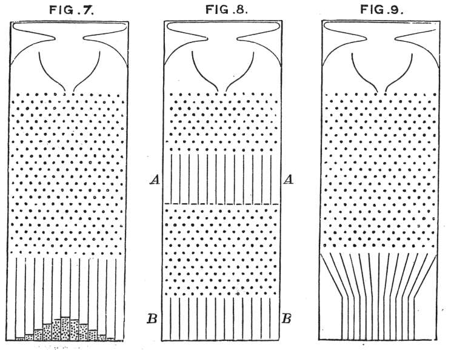

Stability is important for software projects as well:
https://metarabbit.wordpress.com/2017/11/18/numpy-scipy-backwards-stability-debate-and-why-freezing-versions-is-not-the-solution/
In that link, some folks discuss how changes to scipi/numpy are breaking code.
The author points out a spectrum, from "don't break the code" 
[like the linux kernel](http://lkml.iu.edu/hypermail/linux/kernel/1710.3/02487.html)
to the "Silicon-Valley-esque" "move fast and break stuff".
The author sagely points out the later is appropriate for new 
projects, but we can see that the former is needed for stable and
accepted projects that become components of a larger ecosystem,
that dependencies accrue.

Koonin argues that you get "preferrential attachment" of regulatory
networks simply by the more attached nodes having greatly more
consequences if they fail, thus attaching to them is beneficial.

